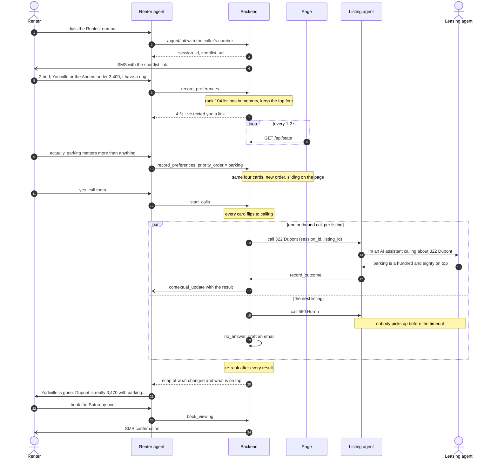
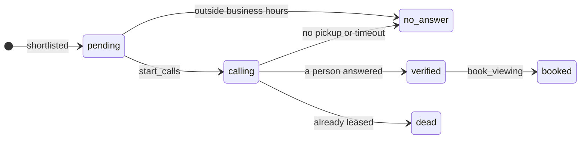
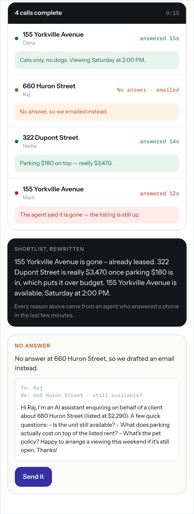
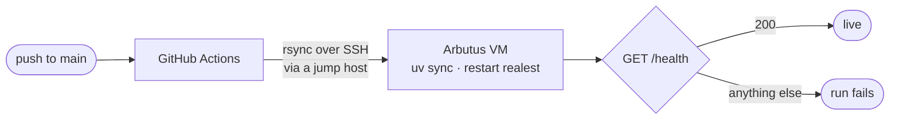

<h1 align="center">Realest</h1>

<p align="center"><b>Which listings are actually real.</b></p>

<p align="center">
Every AI voice agent in real estate works for the brokerage. Realest works for the renter.<br>
You phone it, a page in your hand reorders while you talk, and it calls the listing agents<br>
to find out what no listing will ever tell you.
</p>

<p align="center">
  
</p>

<p align="center"><sub>One session on the live page, sped up 1.5×. The listing agents in this recording are scripted (<a href="#whats-real-and-what-isnt">what that means</a>).<br>Extraction, ranking and the page are the real code paths.</sub></p>

<p align="center">Built in a day by <b>AAMEL</b> at <i>Agents, Everywhere: Bots, Channels &amp; More</i> · Toronto · 12 September 2026</p>

<p align="center">
  <a href="#the-problem">The problem</a> ·
  <a href="#what-a-call-looks-like">What a call looks like</a> ·
  <a href="#a-real-call-in-full">A real call</a> ·
  <a href="#system-design">System design</a> ·
  <a href="#run-it">Run it</a> ·
  <a href="#whats-real-and-what-isnt">What's real</a>
</p>

---

## The problem

Toronto rental listings are wrong. Units are already leased, "parking included" turns out to be $180 on top, and the pet policy is anyone's guess. Finding listings was never the hard part. Knowing which ones are real is, and the only way to find out is to phone eight people and play voicemail tag for two days.

Realest makes those calls for you, several at once, while you're still on the line with it.

## What a call looks like

| You say | What happens |
|---|---|
| *(you dial the Realest number)* | The renter agent picks up. The backend mints a session at pickup and texts you a link to your shortlist, so it lands while you're still talking |
| *"Two bedroom, Yorkville or the Annex, under thirty-four hundred. I've got a dog."* | `record_preferences` fires, 104 real Toronto listings are ranked in memory, and four cards fill the page |
| *"Actually, parking matters more than anything."* | Same four listings, new weights. The cards slide into a new order before you've finished the sentence |
| *"Yes, call them. Ask if there's a locker."* | Every card flips to *Calling* and the backend places one outbound call per listing, in parallel. Each call opens by saying it's an AI, then asks what the listing doesn't say |
| *(the listing agents answer)* | Each result lands on its card with the name of whoever said it, the list re-ranks, and the result is pushed into your live call as it lands. Nobody picked up? It drafts an email instead |
| *"Book the Saturday one."* | `book_viewing` writes the booking in plain code and texts you the confirmation |

<p align="center">
  
</p>
<p align="center"><sub>Reordered by "parking matters most" · four calls in flight · rewritten from what the listing agents said</sub></p>

The listing that opened at number one was leased on Tuesday, and it ends the call struck through at the bottom. 322 Dupont, on top a moment earlier, is really $3,470 once the $180 parking is in. That's over budget, so it drops to third. 660 Huron didn't answer, and there's a drafted email waiting for a tap. The Yorkville unit at $2,690 is available Saturday at two and gets booked, and its card carries the catch: cats only, and you have a dog. It stays on the board, and you decide.

**Every move on that board traces back to something a person said on the phone seconds earlier.**

## A real call, in full

Placed at 13:53 on build day to a real phone and answered by a person. This is the transcript ElevenLabs returned, not a reconstruction:

```
AI:    Hello, my name is Alex, and I'm an AI assistant calling on behalf of a
       renter. I'm calling about the listing at 155 Yorkville Avenue.
Agent: Hello.
AI:    Thank you for taking my call. I am inquiring about your rental listing
       and wanted to confirm if the unit is still available?
Agent: Uh, yes, it is available.
AI:    Great, thank you. Could you please tell me the exact monthly cost for
       parking, separate from the rent?
Agent: It's $200 per month.
AI:    Thank you, that is two hundred dollars per month. Could you also please
       clarify your pet policy for this unit?
Agent: Uh, no pet is allowed.
AI:    Understood, no pets are allowed. Finally, could you please let me know
       what viewing slots you have available for the renter?
```

What the ranker got out of it:

```json
{ "available": true,
  "addons": ["parking $200/month"],
  "pets_allowed": "no",
  "viewing_slot": "Friday at 2:00 p.m.",
  "source": "Agent" }
```

Two facts that were in no listing: a $200 parking charge and a no-pets policy. The real rent quietly became $2,890 instead of $2,690. That's the whole product in one call.

One live call we timed ran 131 seconds. The calls run in parallel, so checking four listings takes about as long as checking one.

## Why this can't be a chatbox

1. **It phones third parties.** A chat window can't place a call to a human being.
2. **The deciding information exists nowhere online.** *Is it still available, what does parking really cost, will you take a dog* lives in a leasing agent's head until somebody asks. No model, index or scrape can retrieve it. The agent creates that data by talking to a person.
3. **Voice and screen are one live session.** You're on the phone while a page in your other hand re-renders from the same agent state. One conversation, rendered twice, each channel doing what it's good at.

## System design

One session store is the source of truth. The voice agents write to it through webhook tools, the page reads it by polling, and the two never talk to each other. That single rule is why a call still finishes when the page dies, and why the whole product could be built and rehearsed by typing before any phone rang.

### Architecture


| Piece | Runs on | Its job |
|---|---|---|
| Renter agent | ElevenLabs Conversational AI, answering the Twilio number | Talks to you. Its tools are `record_preferences`, `start_calls`, `book_viewing` and `send_sms` |
| Listing agent | ElevenLabs Conversational AI, dialling out over Twilio | Calls one leasing agent, then reports back through `record_outcome` |
| Backend | FastAPI under systemd on an Arbutus VM | Webhook tools, the session store, ranking, call orchestration, SMS |
| Extraction | Any OpenAI-compatible model | Turns a call transcript into a typed `CallOutcome` |
| Live page | Next.js 15 on Vercel | Server-renders your shortlist, then polls `/api/state` through its own proxy |

### One call, end to end



### The session store

Everything the page shows, and everything the agents need to remember, lives in one object per session ([`server/schemas.py`](server/schemas.py)):

```python
class SessionState(BaseModel):
    session_id: str
    caller_phone: str = ""            # where the SMS goes
    preferences: Preferences          # beds, areas, budget, parking, pets, priorities
    listings: list[ListingState]      # ranked: index 0 is the top pick
    agent_says: str = ""              # the last line spoken, for the page header
    updated_at: float = 0.0
```

This is what `/api/state` returned at the end of the session in the recording above, trimmed to the interesting fields:

```json
{
  "session_id": "x7Kp2mQa",
  "preferences": { "beds": 2, "areas": ["Yorkville", "The Annex"], "max_rent": 3400,
                   "parking": true, "pets": "dog", "priority_order": ["parking"] },
  "listings": [
    { "listing_id": "L086", "address": "155 Yorkville Avenue", "rent": 2690,
      "rank": 1, "status": "booked",
      "outcome": { "available": true, "pets_allowed": "Cats only, no dogs",
                   "viewing_slot": "Saturday at 2:00pm", "source": "Priya" } },
    { "listing_id": "L100", "address": "660 Huron Street", "rent": 2290,
      "rank": 2, "status": "no_answer", "outcome": null,
      "email_draft": "Subject: 660 Huron Street - still available? ..." },
    { "listing_id": "L095", "address": "322 Dupont Street", "rent": 3290,
      "rank": 3, "status": "verified",
      "outcome": { "available": true, "real_rent": 3470, "addons": ["parking $180"],
                   "source": "Mark" } },
    { "listing_id": "L092", "address": "155 Yorkville Avenue", "rent": 3000,
      "rank": 4, "status": "dead",
      "outcome": { "available": false, "source": "Agent" } }
  ],
  "agent_says": "Booked - 155 Yorkville Avenue, Saturday at 2:00pm. Confirmation is on its way by text."
}
```

Every write goes through one `mutate()` behind an `asyncio.Lock` and bumps `updated_at`. Three call results can land within a second of each other, and two coroutines writing `listings` at once is a real bug here, not a theoretical one. Outcome writes and the re-rank that follows them share a second lock, so concurrent results can't clobber each other's order. Ranking happens on write, never on read, and the page never sorts: index 0 is the top pick because the server put it there. `outcome` stays `null` until a person has actually said something. Listing agents' phone numbers and emails are stripped out before a card ever reaches the browser.

### Three ways in, one set of handlers

The ElevenLabs agents call the `/agent/*` webhooks directly. The first voice bridge (Twilio Media Streams to OpenAI Realtime, [`server/bridge.py`](server/bridge.py)) and the text harness (`POST /chat`) both go through one function that calls those same handlers:

```python
dispatch(tool_name, args, session_id) -> str   # the line to speak back
```

Every handler returns a short `speak` line written as speech, because a voice agent is going to read it aloud. The call transport is swappable in the same spirit. With `TRANSPORT=stub`, scripted listing agents answer and their transcripts still go through the real extraction, schema and re-rank. `TRANSPORT=voice` dials for real. That is how four people built the whole loop by typing while the telephony was still being wired up.

Inbound calls arrive cold, with no session attached. `/agent/init` runs as ElevenLabs' conversation-initiation webhook at pickup: it mints the session, captures the caller's number, texts the link and hands `session_id` back as a dynamic variable for the rest of the call. Tool fields the model must never invent, like `session_id`, `listing_id` and the caller's number, are bound to dynamic variables in the tool schemas. If a tool call still arrives without a session, the backend falls back to the ElevenLabs conversation id, then to the caller's most recent session, before it mints a new one.

### Calling the listing agents

- `start_calls` flips every selected card to *calling* before anything is dialled, so the page shows the calls going out together. Then `asyncio.gather` places them, with `return_exceptions=True` so one failed call can't take the others down.
- Each listing gets its own line. `DEMO_AGENT_PHONE` is a list, listing *i* rings number *i*, and the fan-out stops when the numbers run out.
- A result can come back two ways. The fast path is the listing agent's `record_outcome` webhook. The safety net is a watcher that polls the ElevenLabs conversation every 5 seconds and runs extraction on the transcript if the webhook never arrives. Whichever lands first wins, and the other is ignored.
- Nothing is left spinning. A timeout at 120 seconds, an error or an empty transcript turns the card into *no answer* and drafts an email.
- Each result is also pushed into the renter's open call as a `contextual_update` over ElevenLabs' monitoring socket, so the agent on your line knows what the leasing agent said. When the last call finishes, `start_calls` returns one spoken recap.



### Extraction: only what was said

`CallOutcome` is the product, so the extractor has one rule above the others: if the person didn't say it, the field stays empty.

```python
class CallOutcome(BaseModel):
    """What a human actually told us. This is the whole product."""
    available: bool | None = None
    real_rent: int | None = None                       # listed rent + every mandatory add-on
    addons: list[str] = Field(default_factory=list)    # "parking $180", "locker $40"
    pets_allowed: str | None = None
    viewing_slot: str | None = None
    answers: dict[str, str] = Field(default_factory=dict)   # your extra questions, answered
    source: str = ""                                   # who said it: provenance for the card
    raw_transcript: str = ""
```

It runs as structured output (`chat.completions.parse` with `response_format=CallOutcome`) on whichever provider has a key: OpenAI, OpenRouter, or Gemini through its OpenAI-compatible endpoint. One code path covers all three. Add-ons have to come back with a figure in digits ("parking $180", even when the agent said "a hundred and eighty"), because the rent arithmetic downstream reads digits, not prose. If the model call fails, the card keeps the raw transcript and a source rather than a guess.

### Ranking

The reshuffle is the demo, so the order is decided by plain code: one pure, synchronous function with no network hop in it, because it runs while somebody is mid-sentence. It runs on exactly two triggers, a preference change and a call result. The model never decides the order. It only narrates it.

| Rule, in order of force | Why |
|---|---|
| A booked viewing pins to the top | It's the decision you made |
| A leased unit sinks to the bottom | Whatever its fit, it's gone |
| Real rent replaces listed rent | Listed rent plus every mandatory add-on, the moment a person names them. Over budget demotes hard |
| Verified beats unverified | Worth 7 points on a roughly 30-point scale, so "we phoned and confirmed" isn't beaten by a cheaper maybe |
| Then weighted fit | Weights follow the order you most recently said things matter in: 3, 2, 1 |
| Conflicts annotate, never remove | Cats only against your dog stays on the board with the reason. You decide |
| Ties keep their place | The previous rank breaks ties, so cards never jitter between polls |

Neighbourhoods are fuzzy on purpose. An exact area match scores 30, a walkable neighbour 14, anywhere else −30. Someone who says "King West" means "or near enough that I'd still go and see it", and strict matching returns an empty shortlist, which is worse than a Liberty Village unit one streetcar stop away. The card always shows the real neighbourhood.

Once a shortlist exists, later preferences reorder those cards rather than swapping new ones in, so the board never changes under your thumb while you're looking at it.

The same pass writes the recap the agent speaks, so the explanation can't drift from what the page shows. From the recording above:

> *"155 Yorkville Avenue is gone - already leased. 322 Dupont Street is really $3,470 once parking $180 is in, which puts it over budget. 155 Yorkville Avenue is available, Saturday at 2:00 PM."*

<details>
<summary>Every scoring term</summary>

<br>

| Term | Points |
|---|---|
| Bedrooms | +30 for an exact match, −18 per bedroom off |
| Neighbourhood | +30 in a named area, +14 in a walkable neighbour, −30 elsewhere |
| Bathrooms | +3 if there are enough, −4 if not |
| Budget, on real rent | Under: (2 + headroom ÷ 350) × w, headroom capped at $700. Over: −(10 + overage ÷ 80) × w, overage capped at $800 |
| Parking, if you need it | +5 × w if included, −2 × w if not |
| Transit, once it's a top-two priority | (15 − minutes to the stop) ÷ 2 × w, never below zero |
| Pets | +4 if the stated policy fits, −5 on a stated conflict |
| Confirmed by phone | +7 |

`w` is 3, 2 or 1 for the first, second and third thing you said matters most, 0.5 after that, and 1 if you never ranked it. The code is in [`server/listings.py`](server/listings.py).

</details>

### The page

<p align="center">
  
</p>
<p align="center"><sub>Below the cards: every call and what it turned up, the agent's recap, and the email it drafted when nobody answered</sub></p>

- One route, `/s/[sid]`, server-rendered from the backend so the first paint is your shortlist and not a spinner.
- It polls `/api/state` every 1.2 seconds through its own Next.js route handler, never the backend directly. Some carrier and corporate DNS block tunnel domains, and the proxy also keeps CORS and the backend's address out of the client.
- A bad poll never blanks the board. Failed requests keep the last good state, a slow response that loses the race is dropped by `updated_at`, and an empty answer can't wipe a live shortlist.
- Each listing is one DOM node in an absolutely positioned slot. A re-rank changes only its `translateY`, so the card travels to its new place over 0.6 seconds and React never has to move a node mid-transition.
- The correction is the loudest thing on a card: listed rent struck through beside the real figure, and every fact from a call followed by who said it.
- Calls that start on the same poll share one start time, so four timers tick in unison. A live region announces each reorder to screen readers, and reduced-motion settings are respected.
- You can tap cards and pick questions instead of saying them. Both paths hit the same endpoint, and the voice loop never depends on the page.

### When things go wrong

| If | Then |
|---|---|
| A listing agent doesn't pick up | The card goes to *no answer*, an email is drafted and shown in full with a Send button, and the agent tells you |
| It's outside 9:00 to 19:00 | The agent declines to dial and says why, then drafts emails instead. That's judgment about people, not a retry |
| The `record_outcome` webhook never arrives | The watcher pulls the transcript from ElevenLabs and extracts it |
| Both paths deliver a result | The first one wins and the second is ignored |
| The model call fails | The card keeps the raw transcript and a source. Nothing is invented |
| A call hangs | It times out at 120 seconds and becomes *no answer*. No card is left spinning |
| An SMS fails or fires twice | One retry, and identical texts inside 30 seconds go out once. A failed text never breaks the call around it |
| A tool call arrives without a session | The conversation id, then the caller's number, are tried before a new session is minted |
| The model says an address instead of an id | Ids are matched first, then addresses, so "call Dupont" still reaches the right listing |
| The page loses the backend | The board keeps its last good state, and the call carries on |

### Deployment

Every push to `main` deploys the backend. A GitHub Actions workflow loads a deploy key from repository secrets, reaches the Arbutus VM through a jump host, rsyncs the repo across (never `.env`, never generated data), runs `uv sync`, restarts the `realest` systemd service and fails the run unless `/health` answers. A newer push cancels a deploy that's still in flight. The page lives on Vercel and finds the backend through a single `BACKEND_URL`.



<details>
<summary>The webhook surface</summary>

<br>

| Endpoint | Called by | What it does |
|---|---|---|
| `POST /agent/init` | ElevenLabs, as an inbound call connects | Mints the session, binds the renter conversation, texts the link, returns `session_id` and `shortlist_url` as dynamic variables |
| `POST /agent/preferences` | Renter agent, `record_preferences` | Merges preferences, re-ranks, returns a line to speak plus the shortlist ids |
| `POST /agent/start-calls` | Renter agent, `start_calls`, or the page's Call button | Pairs listings with numbers, flips cards to calling, fans out, waits, returns the recap |
| `POST /agent/outcome` | Listing agent, `record_outcome`, or the watcher | Writes the outcome, re-ranks, pushes the result into the renter's call |
| `POST /agent/book` | Renter agent, `book_viewing` | Marks the card booked and texts the confirmation |
| `POST /agent/sms` | Renter agent, `send_sms` | Texts the shortlist link, once per session |
| `POST /agent/email` | The page's Send button | Sends a drafted email through Resend, when configured |
| `GET /api/state` | The page, through its proxy | The ranked session, joined with listing data |
| `POST /chat`, `GET /chat` | You, typing | The renter agent over text, and a small harness page |
| `/twiml/{role}`, `/media/{role}` | Twilio | The OpenAI Realtime bridge |
| `GET /health` | The deploy job | Transport, voice provider, listing and session counts |

</details>

## Stack

| Layer | Choice | Used for |
|---|---|---|
| Voice, both directions | **ElevenLabs Conversational AI** on a **Twilio** number | The renter and listing agents, webhook tools, transcripts, live `contextual_update` |
| SMS | **Twilio** | The shortlist link and booking confirmations |
| Extraction | **OpenAI** structured outputs through the OpenAI SDK | `CallOutcome` from transcripts, on OpenAI, **OpenRouter** or **Gemini**, whichever key is set |
| Backend | Python 3.12, **FastAPI**, Pydantic v2, httpx, uv | Webhooks, the session store, ranking, orchestration |
| Live page | **Next.js 15**, React 19, Tailwind 4, strict TypeScript, on **Vercel** | The board on your phone |
| Delivery | **GitHub Actions** to an **Arbutus** VM under systemd | Continuous deployment of the backend |
| Local dev | **ngrok** static domain | Public webhooks for a backend on a laptop |
| First voice bridge | **OpenAI Realtime** over Twilio Media Streams | `server/bridge.py`, selected with `VOICE_PROVIDER=openai_realtime` |

## Repository

```
server/                 FastAPI, the whole backend
  main.py               webhook tools (/agent/*), /api/state, the one re-rank path
  state.py              the session store: one dict, one lock, one mutate()
  schemas.py            Preferences, CallOutcome, Listing, SessionState
  listings.py           rank(), fit(), explain(), neighbourhood adjacency
  calls.py              fan-out, the watcher, extraction, SMS, email drafts, live inject
  transport.py          TRANSPORT=stub|voice and the scripted listing agents
  voice/elevenlabs.py   outbound calls, transcripts, the monitoring-socket inject
  chat.py               the text transport: same prompt, same tools
  bridge.py             Twilio Media Streams to OpenAI Realtime, in-process tools
web/                    the Next.js page
  app/s/[sid]/          the one route the SMS link opens
  app/api/              proxies for state, calls and email
  components/           Board, Listings, CallsPanel, VerifyPrompt, Outcome, Header
  lib/                  usePolling, useCallTimers, present (state to view)
agent/                  tool definitions: ElevenLabs webhooks and Realtime functions
data/                   the scraped rentals.ca snapshot (listings.json is generated)
tests/                  pytest, no credentials or phone needed
scripts/                doctor, key probe, seeding, call-log browser, voice spikes
.github/workflows/      deploy.yml
.claude/skills/         per-area build guides the team and its coding agents worked from
```

## Run it

```bash
cp .env.example .env            # fill in keys
make install                    # uv sync, npm install, git hooks
make listings PHONE=+1416... EMAIL=you@example.com
make seed                       # validate every listing row
make dev                        # FastAPI on :8000
make web                        # the page on :3000
make doctor                     # tells you what's still missing
```

You don't need a phone to try it. `TRANSPORT=stub`, the default, scripts the listing agents, and `localhost:8000/chat` talks to the same renter agent by text, with the same tools. To dial for real, set `TRANSPORT=voice`, `VOICE_PROVIDER=elevenlabs` and `DEMO_AGENT_PHONE` to a comma-separated list of numbers you own. The dashboard side is in [docs/ELEVENLABS.md](docs/ELEVENLABS.md).

```bash
FORCE_BUSINESS_HOURS=1 uv run pytest
```

The suite needs no credentials and no phone. It covers the ranking fixtures that encode the demo's reshuffle, SMS timing, dedupe and retries, the stub transport end to end, the demo scripts staying in sync with [docs/DEMO.md](docs/DEMO.md), inbound session continuity, per-listing phone pairing and live context injection. One extraction test runs against a real model, and only when a key is set. The business-hours flag is there because one test places calls, and after 19:00 the agent would rightly refuse.

A few more targets that earned their place during the build: `make keys` probes what each API key actually unlocks, `make calls` browses ElevenLabs call logs, `make start-call` fires `start_calls` with custom fields, and `make todo` rebuilds the build-day task board from commit messages.

## What's real, and what isn't

We'd rather tell you than have you find it in the source.

| | What it covers |
|---|---|
| **Real** | Inbound and outbound voice on ElevenLabs over a Twilio number. Parallel outbound calls, one per listing, each to its own teammate's phone. `CallOutcome` extraction, ranking and re-ranking. Call results pushed into the live renter call. The live page, SMS, email drafts and continuous deployment |
| **Scripted** | The recorded demo and the recordings in this README use `TRANSPORT=stub`: a scripted listing agent answers instead of a phone. Its transcripts go through the same extraction, the same schema and the same re-rank. Only the dial tone is fake, and `TRANSPORT=voice` swaps in real calls without anything else moving |
| **Seeded** | 104 Toronto listings scraped from rentals.ca before the event, with real addresses, rents and photos. `parking_included` and `pets` are deliberately synthesized, because they're exactly the facts a listing doesn't state reliably, which is the premise |
| **Off by default** | Email. Drafts are shown in full, and Send goes out through Resend only when a key is configured |

## How it behaves around real people

- It says it's an AI in the first sentence of every outbound call.
- It dials only when you ask, and only numbers on the demo list, every one of them a teammate's.
- It won't call outside business hours. It says so and offers email.
- Every fact on a card carries the name of whoever said it.
- It never records a fact a person didn't say. If they didn't mention pets, the field stays empty.
- No realtor contact details were scraped. Every phone number and email in the dataset belongs to a teammate.

## Prior art

The category exists, entirely on the other side of the table. EliseAI, Funnel, Yardi Chat IQ, CloudTalk and Bland all sell inbound lead capture to property managers: they answer the phone, qualify you, and book you into the brokerage's calendar.

Realest is the inverse. It represents the renter and dials out. We couldn't find that shipped anywhere.

## Built on 12 September 2026

Scaffolding, credentials, dependencies, the scraped dataset and the docs were prepared the night before, which the event rules allow. Every stub carried a `TODO(hackathon)` marker, and none remain. Build-day commits start at 11:29, and the event's build window closed at 15:30.

The team kept building that evening. Calling several listing agents on separate numbers, pushing call results into the live renter call and continuous deployment were all added after 15:30, along with fixes to how inbound calls hold on to their session. The commit log has every timestamp.

## Known limitations

- The session store lives in memory in one process, so a restart forgets live sessions.
- Each parallel call needs its own number in `DEMO_AGENT_PHONE`. When the numbers run out, the rest of the shortlist isn't dialled.
- The shortlist is chosen on the first brief. Later preferences reorder it but never swap listings in.
- Results reach the renter's live call only when Monitoring is enabled on the ElevenLabs renter agent.
- A figure said in words ("two hundred a month") occasionally fails to come back as digits. The raw transcript is always kept.
- The listings are a dated snapshot.

---

<p align="center"><i>Realest: it was hiding inside <b>real est</b>ate the whole time.</i></p>
