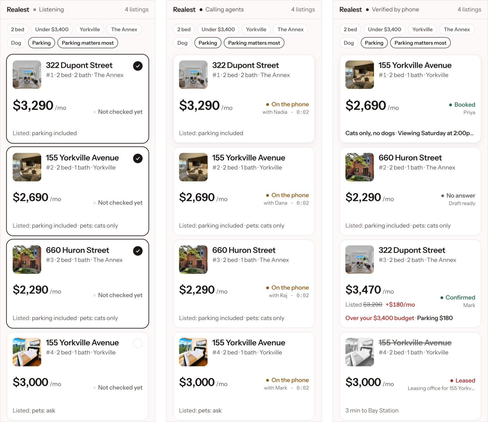
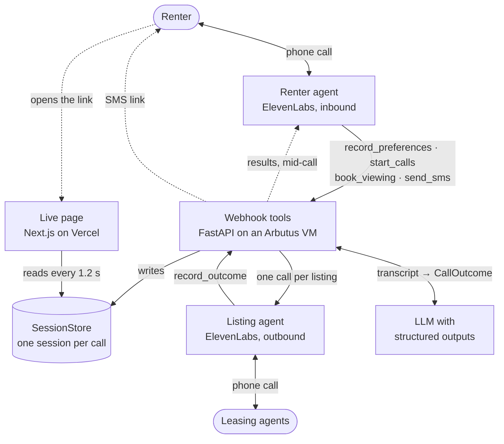
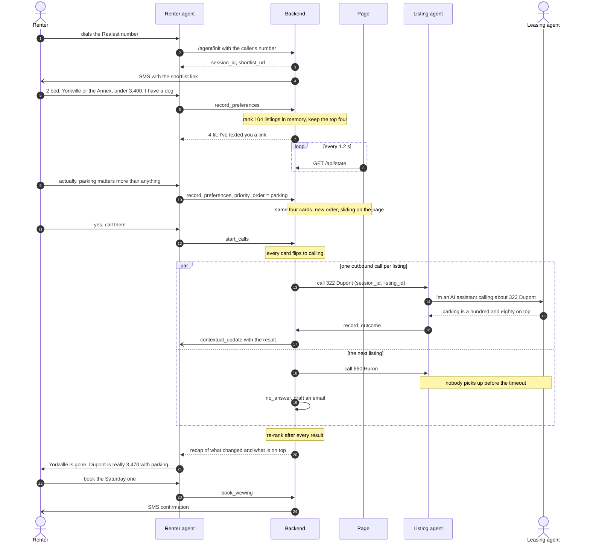
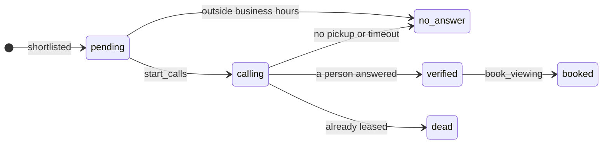
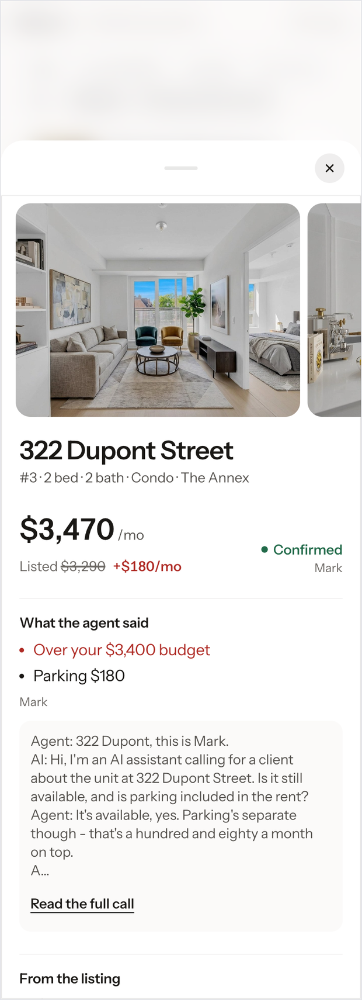

<h1 align="center">Realest</h1>

<p align="center"><b>Which listings are actually real.</b></p>

<p align="center">
Every AI voice agent in real estate works for the brokerage. Realest works for the renter.<br>
You phone it, a page in your hand reorders while you talk, and it calls the listing agents<br>
to find out what no listing will ever tell you.
</p>

<p align="center">
  <a href="https://youtu.be/A5do1Vd4TgI">
    
  </a>
</p>

<p align="center"><a href="https://youtu.be/A5do1Vd4TgI"><b>Watch the two-minute demo</b></a></p>

<p align="center">
  
</p>

<p align="center"><sub>One session on the live page, sped up 1.5×. The listing agents in this recording are scripted (<a href="#whats-real-and-what-isnt">what that means</a>).<br>Extraction, ranking and the page are the real code paths.</sub></p>

<p align="center">Built in a day by <b>AAMEL</b> at <i>Agents, Everywhere: Bots, Channels &amp; More</i> · Toronto · 12 September 2026</p>

<p align="center">
  <a href="https://youtu.be/A5do1Vd4TgI">Demo</a> ·
  <a href="#the-problem">The problem</a> ·
  <a href="#what-a-call-looks-like">What a call looks like</a> ·
  <a href="#a-real-call-in-full">A real call</a> ·
  <a href="#system-design">System design</a> ·
  <a href="#run-it">Run it</a> ·
  <a href="#whats-real-and-what-isnt">What's real</a>
</p>

---

## The problem

Toronto rental listings are wrong. Units are already leased, "parking included" turns out to be $180 on top, and the pet policy is anyone's guess. Finding listings was never the hard part. Knowing which ones are real is, and the only way to find out is to phone eight people and play voicemail tag for two days.

Realest makes those calls for you, several at once, while you're still on the line with it.

## What a call looks like

| You say | What happens |
|---|---|
| *(you dial the Realest number)* | The renter agent picks up. The backend mints a session at pickup and texts you a link to your shortlist, so it lands while you're still talking |
| *"Two bedroom, Yorkville or the Annex, under thirty-four hundred. I've got a dog."* | `record_preferences` fires, 104 real Toronto listings are ranked in memory, and four cards fill the page |
| *"Actually, parking matters more than anything."* | Same four listings, new weights. The cards slide into a new order before you've finished the sentence |
| *"Yes, call them. Ask if there's a locker."* | Every card goes on the phone and the backend places one outbound call per listing, in parallel. Each call opens by saying it's an AI, then asks what the listing doesn't say |
| *(the listing agents answer)* | Each result lands on its card with the name of whoever said it, the list re-ranks, and the result is pushed into your live call as it lands. Nobody picked up? It drafts an email instead |
| *"Book the Saturday one."* | `book_viewing` writes the booking in plain code and texts you the confirmation |

<p align="center">
  
</p>
<p align="center"><sub>Reordered by "parking matters most" · four calls in flight · rewritten from what the listing agents said</sub></p>

The listing that opened at number one was leased on Tuesday, and it ends the call struck through at the bottom. 322 Dupont, on top a moment earlier, is really $3,470 once the $180 parking is in. That's over budget, so it drops to third. 660 Huron didn't answer, and there's a draft email ready. The Yorkville unit at $2,690 is available Saturday at two and gets booked, and its card carries the catch: cats only, and you have a dog. It stays on the board, and you decide.

**Every move on that board traces back to something a person said on the phone seconds earlier.**

## A real call, in full

Placed at 13:53 on build day to a real phone and answered by a person. This is the transcript ElevenLabs returned, not a reconstruction:

```
AI:    Hello, my name is Alex, and I'm an AI assistant calling on behalf of a
       renter. I'm calling about the listing at 155 Yorkville Avenue.
Agent: Hello.
AI:    Thank you for taking my call. I am inquiring about your rental listing
       and wanted to confirm if the unit is still available?
Agent: Uh, yes, it is available.
AI:    Great, thank you. Could you please tell me the exact monthly cost for
       parking, separate from the rent?
Agent: It's $200 per month.
AI:    Thank you, that is two hundred dollars per month. Could you also please
       clarify your pet policy for this unit?
Agent: Uh, no pet is allowed.
AI:    Understood, no pets are allowed. Finally, could you please let me know
       what viewing slots you have available for the renter?
```

What the ranker got out of it:

```json
{ "available": true,
  "addons": ["parking $200/month"],
  "pets_allowed": "no",
  "viewing_slot": "Friday at 2:00 p.m.",
  "source": "Agent" }
```

Two facts that were in no listing: a $200 parking charge and a no-pets policy. The real rent quietly became $2,890 instead of $2,690. That's the whole product in one call.

One live call we timed ran 131 seconds. The calls run in parallel, so checking four listings takes about as long as checking one.

## Why this can't be a chatbox

1. **It phones third parties.** A chat window can't place a call to a human being.
2. **The deciding information exists nowhere online.** *Is it still available, what does parking really cost, will you take a dog* lives in a leasing agent's head until somebody asks. No model, index or scrape can retrieve it. The agent creates that data by talking to a person.
3. **Voice and screen are one live session.** You're on the phone while a page in your other hand re-renders from the same agent state. One conversation, rendered twice, each channel doing what it's good at.

## System design

One session store is the source of truth. The voice agents write to it through webhook tools, the page reads it by polling, and the two never talk to each other. That single rule is why a call still finishes when the page dies, and why the whole product could be built and rehearsed by typing before any phone rang.

### Architecture



### One call, end to end



### One store, two channels

Each session is a single object: the caller's number, their preferences, the ranked listings with whatever each call returned, and the last line the agent spoke. Every write goes through one `mutate()` behind an `asyncio.Lock`, because three call results can land within a second of each other. Ranking happens on write, never on read, and the page never sorts: index 0 is the top pick because the server put it there. `outcome` stays `null` until a person has actually said something. From the recording above, trimmed:

```json
{ "preferences": { "beds": 2, "areas": ["Yorkville", "The Annex"], "max_rent": 3400,
                   "parking": true, "pets": "dog", "priority_order": ["parking"] },
  "listings": [
    { "listing_id": "L086", "address": "155 Yorkville Avenue", "rent": 2690, "rank": 1, "status": "booked",
      "outcome": { "pets_allowed": "Cats only, no dogs", "viewing_slot": "Saturday at 2:00pm", "source": "Priya" } },
    { "listing_id": "L095", "address": "322 Dupont Street", "rent": 3290, "rank": 3, "status": "verified",
      "outcome": { "real_rent": 3470, "addons": ["parking $180"], "source": "Mark" } },
    { "listing_id": "L092", "address": "155 Yorkville Avenue", "rent": 3000, "rank": 4, "status": "dead",
      "outcome": { "available": false } } ] }
```

The ElevenLabs agents call the `/agent/*` webhooks. The text harness at `POST /chat` and the original OpenAI Realtime bridge go through the same handlers via one `dispatch(tool, args, session_id)`, and the call transport sits behind one variable: `TRANSPORT=stub` has scripted listing agents answer (their transcripts still go through the real extraction and re-rank), `TRANSPORT=voice` dials. That is how four people built the whole loop by typing while the telephony was still being wired up.

### Calling the listing agents

- `start_calls` flips every selected card to *calling* before anything is dialled, then `asyncio.gather` places one call per listing. One failed call can't take the others down.
- Each listing gets its own line. `DEMO_AGENT_PHONE` is a list, and listing *i* rings number *i*.
- A result comes back two ways: the listing agent's `record_outcome` webhook, or a watcher that polls the ElevenLabs conversation every 5 seconds and extracts the transcript if the webhook never arrives. Whichever lands first wins.
- Each result is also pushed into the renter's open call as a `contextual_update` over ElevenLabs' monitoring socket, so the agent on your line knows what the leasing agent said.



### Extraction and ranking

`CallOutcome` is the product, so the extractor has one rule above the others: if the person didn't say it, the field stays empty. It runs as structured output (`chat.completions.parse` with `response_format=CallOutcome`) on whichever provider has a key, OpenAI, OpenRouter or Gemini, and add-ons must come back as digits ("parking $180", even when the agent said "a hundred and eighty") because the rent arithmetic reads digits, not prose.

The order itself is plain code: a pure, synchronous function with no network hop, because it runs while somebody is mid-sentence. The model only narrates it.

| Rule, in order of force | Why |
|---|---|
| A booked viewing pins to the top | It's the decision you made |
| A leased unit sinks to the bottom | Whatever its fit, it's gone |
| Real rent replaces listed rent | Listed plus every mandatory add-on. Over budget demotes hard |
| Verified beats unverified | Worth 7 points on a roughly 30-point scale, so "we phoned and confirmed" isn't beaten by a cheaper maybe |
| Then weighted fit | Weights follow the order you most recently said things matter in: 3, 2, 1 |
| Conflicts annotate, never remove | Cats only against your dog stays on the board with the reason. You decide |

Neighbourhoods are fuzzy on purpose: an exact match scores 30, a walkable neighbour 14, anywhere else −30, because someone who says "King West" would still go and see a Liberty Village unit one streetcar stop away. The same pass writes the recap the agent speaks, so the explanation can't drift from the page:

> *"155 Yorkville Avenue is gone - already leased. 322 Dupont Street is really $3,470 once parking $180 is in, which puts it over budget. 155 Yorkville Avenue is available, Saturday at 2:00 PM."*

### The page

<p align="center">
  
</p>
<p align="center"><sub>Tap a card and its sheet grows out of it: the correction, who said it, and the call itself</sub></p>

- One route, `/s/[sid]`, server-rendered so the first paint is your shortlist. It then polls `/api/state` every 1.2 seconds through its own proxy, never the backend directly, because some carrier and corporate DNS block tunnel domains.
- A bad poll never blanks the board: failures keep the last good state, a response that loses the race is dropped by `updated_at`, and an empty answer can't wipe a live shortlist.
- Each listing is one DOM node in a fixed-height slot. A re-rank changes only its `translateY`, so the card travels to its new place in about half a second and React never moves a node mid-flight.
- The correction is the loudest thing on a card: the real rent in ink, the listed rent struck beneath it with the word "Listed", and the difference in colour. Figures roll to their new value instead of jumping.
- The detail sheet opens through a clip that starts as the card's exact rectangle and springs open, so the photos inside are never stretched mid-flight.
- Four calls that start together tick together, reorders are announced to screen readers, and reduced-motion settings are respected. Emails for unanswered calls are drafted and shown in full; the page never claims to have sent one.

An operator view at `/admin` shows every live session with its listing calls, the webhook timeline, tool calls and transcripts.

### When things go wrong

| If | Then |
|---|---|
| A listing agent doesn't pick up | The card goes to *No answer*, an email is drafted and shown in full, and the agent tells you |
| It's outside 9:00 to 19:00 | The agent declines to dial and says why, then drafts emails instead. That's judgment about people, not a retry |
| The `record_outcome` webhook never arrives | The watcher pulls the transcript from ElevenLabs and extracts it |
| The model call fails | The card keeps the raw transcript and a source. Nothing is invented |
| A call hangs | It times out at 120 seconds and becomes *No answer*. No card is left spinning |
| An SMS fails or fires twice | One retry, and identical texts inside 30 seconds go out once. A failed text never breaks the call around it |
| The page loses the backend | The board keeps its last good state, and the call carries on |

### Deployment

Every push to `main` deploys: GitHub Actions reaches an Arbutus VM through a jump host, rsyncs the repo (never `.env`, never generated data), syncs dependencies, restarts the backend and admin UI under systemd, and fails the run unless `/health` answers.


## Stack

| Layer | Choice | Used for |
|---|---|---|
| Voice, both directions | **ElevenLabs Conversational AI** on a **Twilio** number | The renter and listing agents, webhook tools, transcripts, live `contextual_update` |
| SMS | **Twilio** | The shortlist link and booking confirmations |
| Extraction | **OpenAI** structured outputs through the OpenAI SDK | `CallOutcome` from transcripts, on OpenAI, **OpenRouter** or **Gemini**, whichever key is set |
| Backend | Python 3.12, **FastAPI**, Pydantic v2, uv | Webhooks, the session store, ranking, orchestration |
| Live page | **Next.js 15**, React 19, Tailwind 4, **Framer Motion**, NumberFlow, on **Vercel** | The board on your phone and the detail sheet |
| Delivery | **GitHub Actions** to an **Arbutus** VM under systemd | Continuous deployment |

## Run it

```bash
cp .env.example .env            # fill in keys
make install                    # uv sync, npm install, git hooks
make listings PHONE=+1416... EMAIL=you@example.com
make seed                       # validate every listing row
make dev                        # FastAPI on :8000
make web                        # the page on :3000
```

You don't need a phone to try it: `TRANSPORT=stub`, the default, scripts the listing agents, and `localhost:8000/chat` talks to the same renter agent by text. To dial for real, set `TRANSPORT=voice`, `VOICE_PROVIDER=elevenlabs` and `DEMO_AGENT_PHONE` to numbers you own ([docs/ELEVENLABS.md](docs/ELEVENLABS.md)). `FORCE_BUSINESS_HOURS=1 uv run pytest` runs the suite with no credentials and no phone.

## What's real, and what isn't

We'd rather tell you than have you find it in the source.

| | What it covers |
|---|---|
| **Real** | Inbound and outbound voice on ElevenLabs over a Twilio number. Parallel outbound calls, one per listing, each to its own teammate's phone. `CallOutcome` extraction, ranking and re-ranking. Call results pushed into the live renter call. The live page, SMS and continuous deployment |
| **Scripted** | The [two-minute demo](https://youtu.be/A5do1Vd4TgI) and the recordings in this README use `TRANSPORT=stub`: a scripted listing agent answers instead of a phone. Its transcripts go through the same extraction, the same schema and the same re-rank. Only the dial tone is fake |
| **Seeded** | 104 Toronto listings scraped from rentals.ca before the event, with real addresses, rents and photos. `parking_included` and `pets` are deliberately synthesized, because they're exactly the facts a listing doesn't state reliably |
| **Drafts only** | Email. Drafts are written and shown in full, never sent |

## How it behaves around real people

- It says it's an AI in the first sentence of every outbound call.
- It dials only when you ask, and only numbers on the demo list, every one of them a teammate's.
- It won't call outside business hours. It says so and offers email.
- It never records a fact a person didn't say. If they didn't mention pets, the field stays empty.
- No realtor contact details were scraped.

## Prior art

EliseAI, Funnel, Yardi Chat IQ, CloudTalk and Bland all sell inbound lead capture to property managers: they answer the phone, qualify you, and book you into the brokerage's calendar. Realest is the inverse. It represents the renter and dials out. We couldn't find that shipped anywhere.

## Built on 12 September 2026

Scaffolding, credentials, dependencies, the scraped dataset and the docs were prepared the night before, which the event rules allow. Build-day commits start at 11:29, and the event's build window closed at 15:30. The team kept building that evening: calling several listing agents on separate numbers, pushing call results into the live renter call, the detail sheet, the admin view and continuous deployment all came after 15:30. The commit log has every timestamp.

## Known limitations

- The session store lives in memory in one process, so a restart forgets live sessions.
- Each parallel call needs its own number in `DEMO_AGENT_PHONE`, and the shortlist is chosen on the first brief: later preferences reorder it but never swap listings in.
- Results reach the renter's live call only when Monitoring is enabled on the ElevenLabs renter agent.
- The listings are a dated snapshot.

---

<p align="center"><i>Realest: it was hiding inside <b>real est</b>ate the whole time.</i></p>
